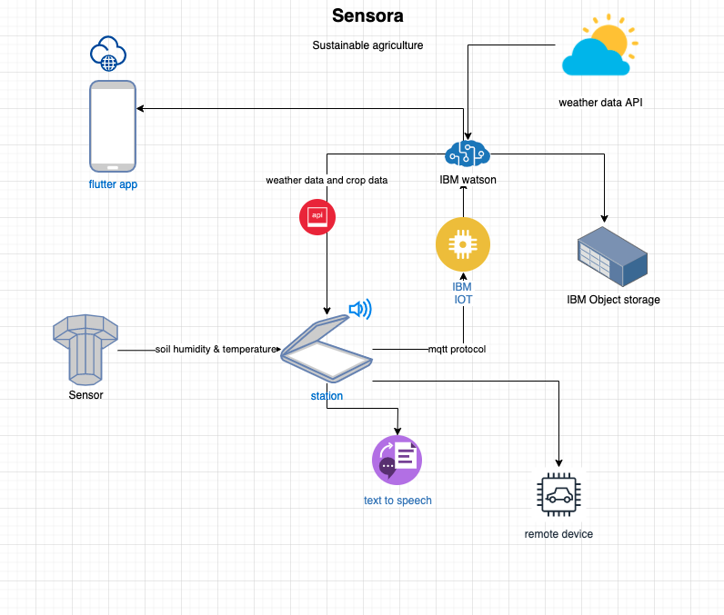
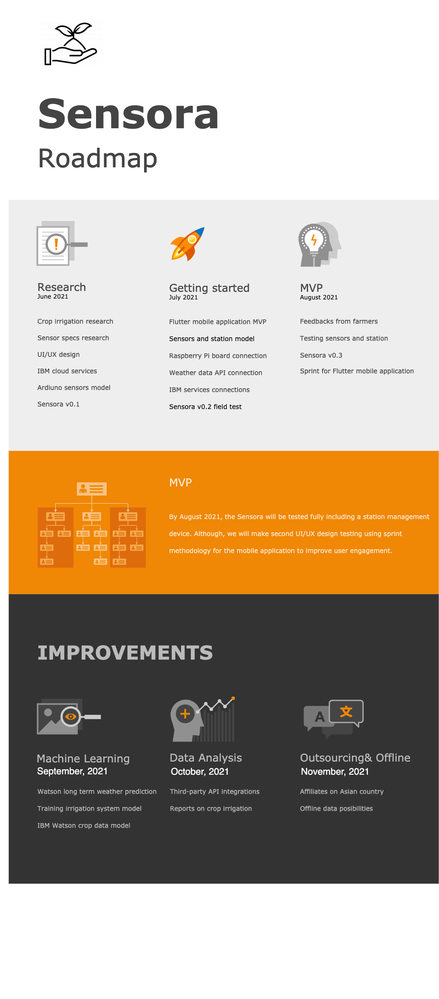

# Sensora

## Short description

Economic and social progress over the past century has been accompanied by drastic environmental degradation that is endangering the very systems on which our future development depends. Regarding sustainable consumption and production patterns, we’ve developed a prototype talking sensor to support smallholder farmers to become responsible producers. The sensor sends environmental telemetry data (temperature, humidity, and spilt moisture) to improve their watering system

## Contents

- [Sensora](#sensora)
  - [Short description](#short-description)
  - [Contents](#contents)
  - [Demo video](#demo-video)
  - [The architecture](#the-architecture)
  - [Long description](#long-description)
  - [Sensora project roadmap](#sensora-project-roadmap)
  - [Getting started](#getting-started)
  - [Built with](#built-with)
  - [Contributing](#contributing)
  - [Authors](#authors)
  - [License](#license)
  - [Acknowledgments](#acknowledgments)

## Demo video

//ADD DEMO HERE

## The architecture

1. //EXPLAIN HERE.
2. Watson Speech to Text processes the audio and extracts the text.
3. Watson Translation (optionally) can translate the text to the desired language.
4. The app stores the translated text as a document within Object Storage.//

## Long description

[Available here for more details](./docs/LDESCRIPT.md)

## Sensora project roadmap

Currently, our project:

- Shows environmental telemetry data of the field/Soil
- Shows weather data

See below for our proposed schedule on the following steps after Call For Code 2021 Submission

## Getting started

//ADD INSTRUCTION

- [sample-react-app](./sample-react-app/)
- [sample-angular-app](./sample-angular-app/)
- [Explore other projects](https://github.com/upkarlidder/ibmhacks)

## Built with

- Text to Speech
- IOT
- Weather Data
- Analytic Engine
- Watson Studio

## Contributing

Please read [CONTRIBUTING.md](CONTRIBUTING.md) for details on our code of conduct, and the process for submitting Sensora pull requests.

## Authors

- **Billie Thompson** - _Initial work_ - [PurpleBooth](https://github.com/PurpleBooth)

## License

This project is licensed under the Apache 2 License - see the [LICENSE](LICENSE) file for details.

## Acknowledgments
//??
